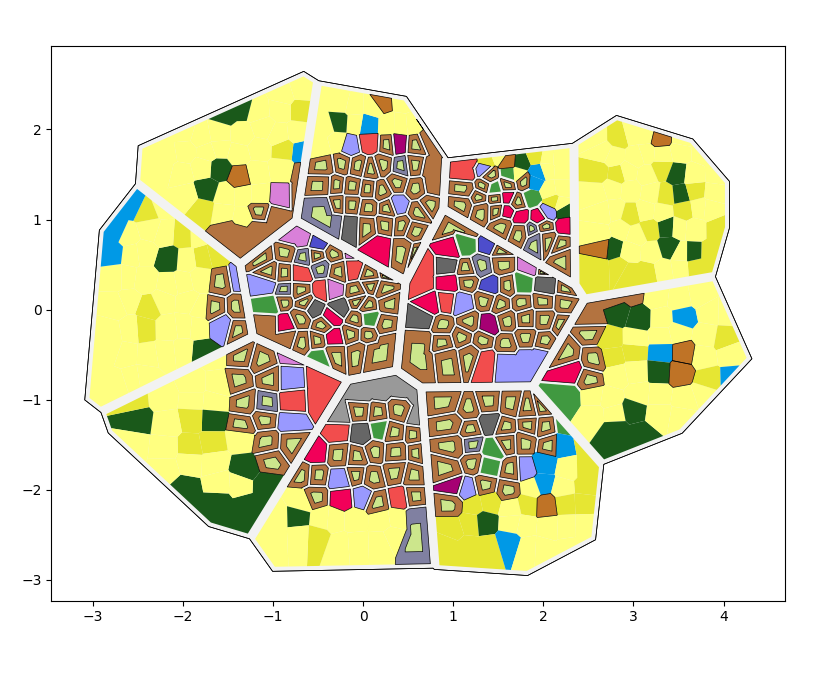

.. PTON documentation master file, created by
   sphinx-quickstart on Sun Jul  4 12:36:11 2021.
   You can adapt this file completely to your liking, but it should at least
   contain the root `toctree` directive.

================================
Générateur de ville: Projet PTON
================================

L'objectif de ce projet est de pouvoir générer et visualiser le plan d'une ville à partir de certaines conditions.

Utilisation
-----------

Pour configurer la génération de la ville, ouvrez ``city.py`` dans ``src`` et modifiez les valeurs attribuées à l'objet ``City``.
La class ``City`` est de la forme:

.. code-block:: python

   City(population, density, has_walls=False, has_castle=False, has_river=False)

Vous pouvez aussi modifier le chemin où la ville générée sera enregistrée.
Pour cela, modifier la chaîne de caractère passée en arguments à ``tools.json``.
Ce chemin sera important pour pouvoir lancer la visualisation ensuite.

.. note::
   
   Le chemin par défaut utilisé par la visualisation est ``/generated_city/city.json``

Voici un exemple de configuration possible pour la ville à générer:

.. code-block:: python

    city = City(10000, 10000, has_walls=True, has_castle=True)
    tools.json(city, '/generated_city/city.json')

Pour lancer la génération::

   python3 src/city.py

Pour visualiser la génération::

   python3 src/viewer.py *chemin_du_fichier*

.. note::

   | Les commandes ci-dessus doivent être lancé depuis la base du projet. 
   | Sinon il faut modifier le chemin vers les fichiers ``.py``.

Voici un exemple de ville générée avec les paramètres présentés précédemment:

Spécification
-------------

Ce projet a été réaliser sous Python, en utilisant les librairies suivantes:

* attrs==21.2.0
* certifi==2021.5.30
* click==8.0.1
* click-plugins==1.1.1
* cligj==0.7.2
* cycler==0.10.0
* Fiona==1.8.20
* geopandas==0.9.0
* iniconfig==1.1.1
* kiwisolver==1.3.1
* matplotlib==3.4.2
* munch==2.5.0
* numpy==1.21.1
* packaging==21.0
* pandas==1.2.5
* Pillow==8.3.0
* pluggy==0.13.1
* py==1.10.0
* pyparsing==2.4.7
* pyproj==3.1.0
* PyQt5==5.15.4
* PyQt5-Qt5==5.15.2
* PyQt5-sip==12.9.0
* pytest==6.2.4
* python-dateutil==2.8.1
* pytz==2021.1
* scipy==1.7.0
* Shapely==1.7.1
* six==1.16.0
* toml==0.10.2
* userprovided==0.9.1

.. toctree::
   :hidden:
   
   src/implémentation.rst

Index et recherche
------------------

* :ref:`genindex`
* :ref:`search`
